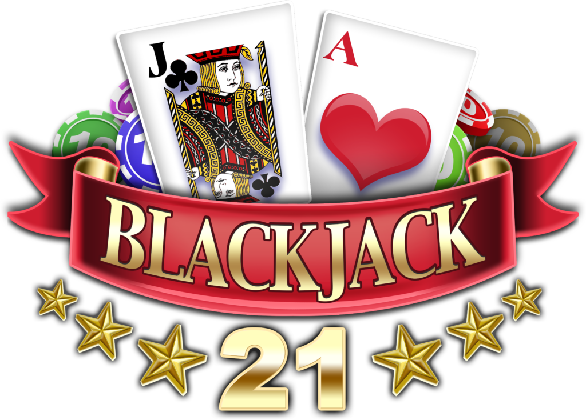
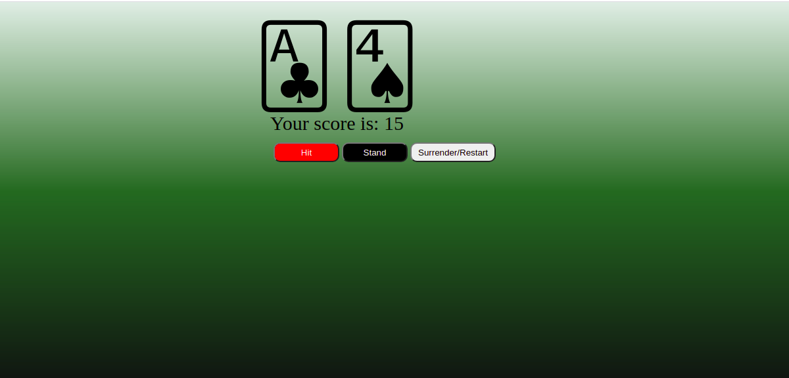

# OOP: Blackjack

### A project created by me - a student of BeCode during our training part about PHP language.

>[Michaela Harinova](https://github.com/mharin)

#### This project is learning challenge type when we are for the first time in touch with OOP (object oriented programming) in PHP. 
#### We need to learn and get basic understanding of OOP.

## The Mission
>Create a Blackjack game in PHP in two days.
> 
>* Keep the code structured by using classes and objects.
>* Try to understand to preset classes (already created - referencing to them during my coding).
>
>* Create base classes with all necessary properties and methods (Player,Dealer,Blackjack) and program the logic of the game vs. player and dealer. 
>* Create an index.php file
>   *require all the files with classes
>   *start/set a session
>   *create 3 buttons hit/stand/surrender
>* Create a logic based on which is decited if you won or lost.

### Blackjack Rules
>- Cards are between 1-11 points.
>    - Faces are worth 10
>    - Ace is always worth 11
>- Getting more than 21 points, means that you lose.
>- To win, you need to have more points than the dealer, but not more than 21.
>- The dealer is obligated to keep taking cards until they have at least 15 points.
>- We are not playing with blackjack rules on the first turn (having 21 on first turn) - we leave this up to you as a nice to have.

#### Flow
>- A new deck is shuffled
>- Player and dealer get 2 random cards
>- Dealer shows first card he drew to player
>- Player either keeps getting hit (asks for more cards), or stands down.
>- If the player at any point goes above 21, he automatically loses.
>- Once the player is done the dealer keeps taking cards until he has at least 15 points. If he hits above 21 he automatically loses.
>- At the end display the winner

## Interface of Blackjack
>#### Starting screen
>
    
>#### Final screen "You win!"
>

>#### Final screen "You lost!"
>

